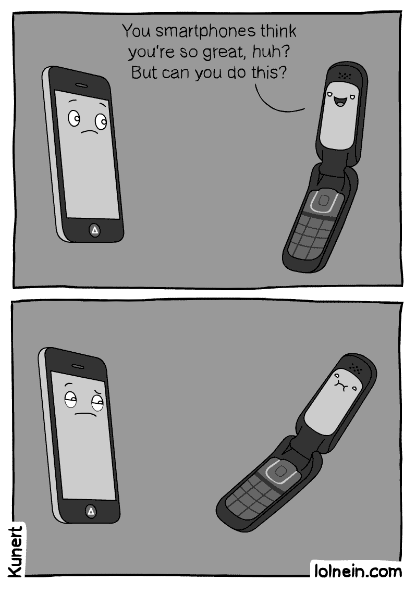

With the society we live in today, if something is not easy to use or navigate, we'd rather not use it. Think about it. Why has everyone moved on from RAZRs to iPhones? Back then, RAZRs were a hit! But now they aren't. However, not everyone is all about that iPhone life 📱. Every family get together I have, we have this running joke about my grandma still having a flip phone. When we ask her why she hasn't upgraded to an iPhone yet, she says she'd rather have her phone because it's easy for *her* to use.

This idea leads into design patterns in software engineering, or computer science for that matter. When learning any programming language, we start off with the basics of a language. This includes variables, classes, objects, for loops, if statements--the list can go on. When we start to develop projects, we are often given a sample to follow that we can then adapt and improve ourselves. The purpose of this sample is so that we can build upon it and make it our own. We're able to create a working app without having to start allll the way at the bottom.

In my personal experience, I have many projects that I've done so far that started as a template or sample, which I then went further to improve. It's an "easy come, easy go" type of thing. Why should I be stubborn and struggle by starting a project from scratch, when there is a template or sample I could use? Although I know not every project I encounter will have a sample system that I can start with, I sure will take advantage of the ones I am given to now! 😅
