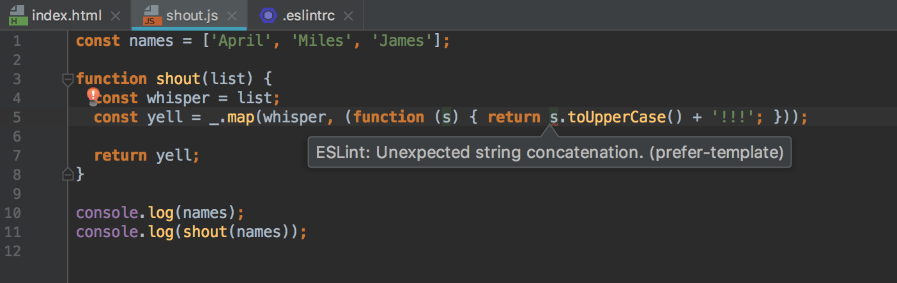

In my Software Engineering class, we recently spent a week working with ESLint on IntelliJ. I'm still trying to get used to IntelliJ, since it is yet another IDE for me to learn. Last semester, I worked with Eclipse; the semester before that, jGRASP.

[ESLint](https://eslint.org/) is an (optional) tool that can be used with IntelliJ that alerts a programmer of syntax errors (and other errors too) within their JavaScript code. The errors that are shown are based on a very *specific* style guide. The goal when using ESLint, is to get rid of all "errors" that come up with a red squiggly underline and X, so that you get a green check mark for your code. Yup, ESLint is basically Microsoft Word's spelling and grammar checker for your JavaScript code.

## What ESLint does
Notice the " " around errors. I say this because, sometimes, what ESLint sees as an error, may not always seem like an error (or a big deal) to us. For example, ESLint will show a syntax error on...
- a line of your code if you use more than two spaces when indenting lines,
- having trailing spaces,
- not including a space before an opening brace, etc.

What do I see as a syntax error?
- a missing opening/closing curly brace or parenthesis
- a missing semicolon

I mean, at least it's specific and tells us where and what the error is (well, some errors at least), right? Just before this, we worked with [JSFiddle](https://jsfiddle.net/), which is an online code editor for JavaScript, HTML, CSS, or CoffeeScript. I would be so *annoyed* when I ran the console and got an error, but was not told what and where the error in my code was.

## What ESLint does not do
It's all fun and games when you finally get the green checkmark, and you run your code, expecting it to work...*BUT IT DOESN'T*. ESLint will show you errors in your code so that you can fix it, just enough for it to compile/run. But, will not tell you whether or not your code will do what it is meant to do? No, it won't.

ESLint can also be very misleading. It'll show "errors" on parts of your code that actually work, just not the way it wants it to. Today, during a (WOD)[http://courses.ics.hawaii.edu/ics314s17/morea/introduction/reading-athletic-software-engineering.html] that I was doing for class

## Final Thoughts

Despite the downsides of using ESLint, having a form of coding standard to follow provides for some sort of method to the madness of what coding can be. For instance...
- Any type of coding standard can be helpful for first-time programmers as it can serve as a guide for them on the do's and don'ts of programming.
- Having a common coding standard facilitates communication between group members on projects, that way everyone is on the same page of understanding, and no one is too confused on what a line of code means or how it was formatted.
I do believe coding standards are important so that our code is readable to others. However, I don't feel that it's more important than having code that actually works. As programmers, I feel like our top priority should be whether or not our code works (the way its *supposed* to), the styling of our code comes next. Personally, I focus more on getting my code to work first, and then fixing it up so that it's clean and easy to read.
