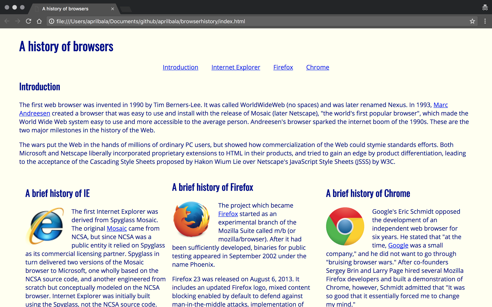
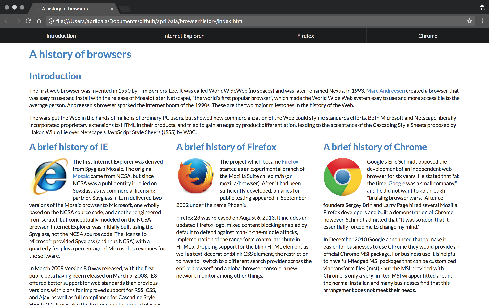
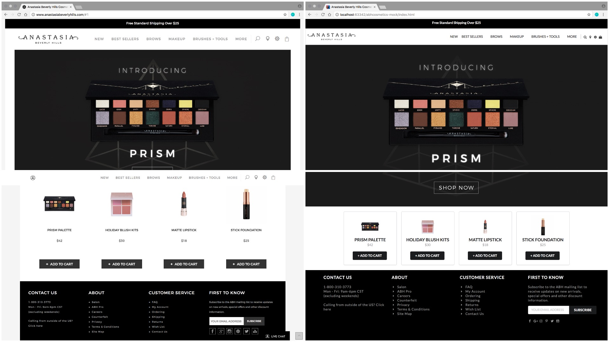

Semantic UI has been so fun to work with. For as long as I can remember, I've always wanted to design a website from scratch...and with Semantic UI I was finally able to fulfill that want. It'll only get better from here (or at least I hope it will 😉).

The deal with Semantic UI is that we get to fix basic, plain, non-aesthetically pleasing pages likes this...

and turn them into this!

[Semantic UI](https://semantic-ui.com/) provides software engineers a numerous amount of UI elements and styles to use in their pages. For example, there are...
- dropdowns
- menus
- icons <i class="hashtag icon"></i><i class="hand peace icon"></i>
- cards
- buttons <button class="circular ui icon button"><a href="https://static.pexels.com/photos/39317/chihuahua-dog-puppy-cute-39317.jpeg"><i class="photo icon"></i></a></button> (*Click the button for something cute!*)
- and many more.

In my software engineering class, we were able to practice our Semantic UI skills by remaking already existing websites (that do not use Semantic UI), like [Island Snow](https://islandsnow.com/). We also had the opportunity to remake a website of our choice. I chose a makeup brand, [Anastasia Beverly Hills](http://www.anastasiabeverlyhills.com/). The screenshots on the left side of the following collage is the original website, while the right side are my takes on it with the use of Semantic UI elements. I implemented the headers (which include a dropdown menu), footer, and the center image that is displayed on the website page. In addition, I used [cards](https://semantic-ui.com/views/card.html) to display the latest products that this brand is promoting, with makeshift '+ Add to Cart' [buttons](https://semantic-ui.com/elements/button.html).

To see the code for this, you can click [here](https://github.com/aprilbala/abhcosmetics-mock).

I've heard a bunch of mixed feelings about Semantic UI. Some don't care much for the looks that it can give, and rather stick to basic HTML/CSS. And others are the exact opposite. From a software engineering point of view, using Semantic UI can be very essential when it comes user-friendliness and likability. For example, users like it when a website is clean looking and easy to use. Semantic UI also gives a modern-look, as opposed to basic HTML.

As you can see, with Semantic UI there are many ways to improve basic looking HTML websites. The way I see it, Semantic UI is like girls using makeup. We can choose to use it if we want to, but we don't have to. There's nothing wrong with not using makeup, and walking around with a bare face. Just like there's nothing wrong with basic HTML. The makeup and Semantic UI is just an additional layer that spruces up looks.
