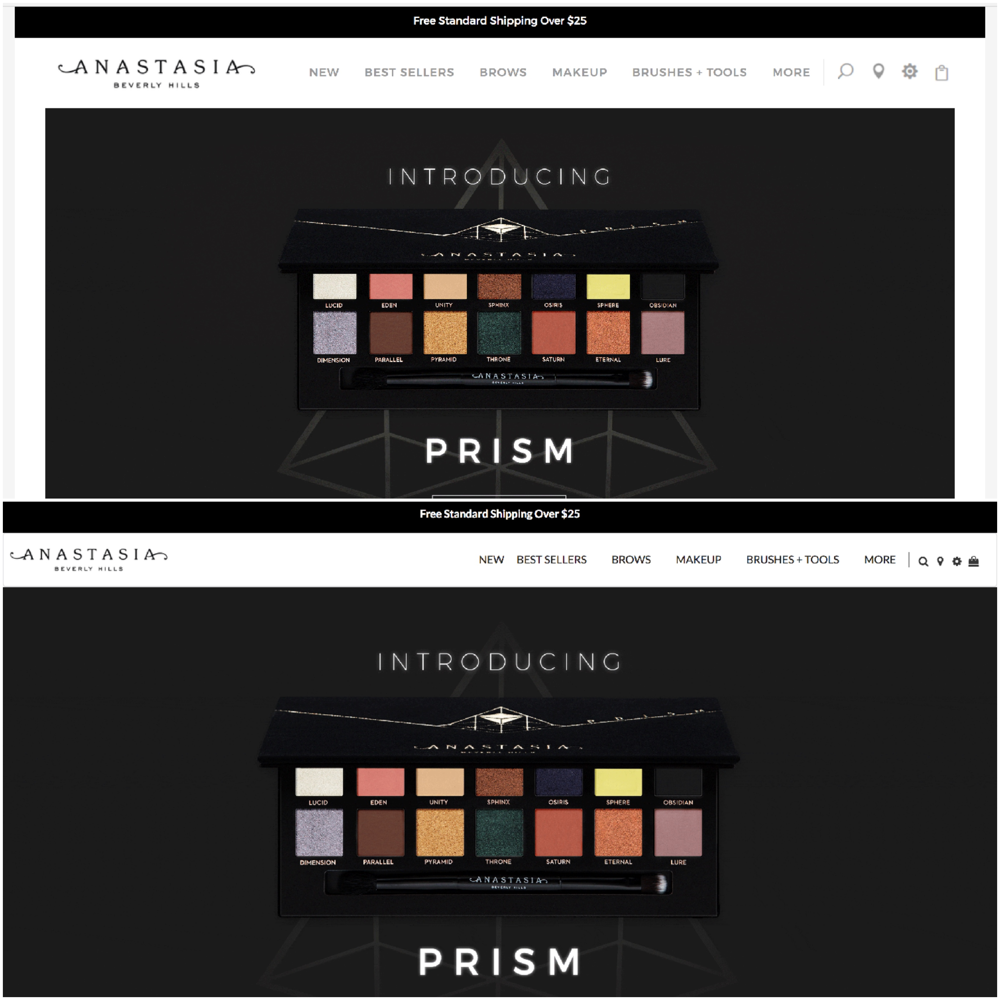
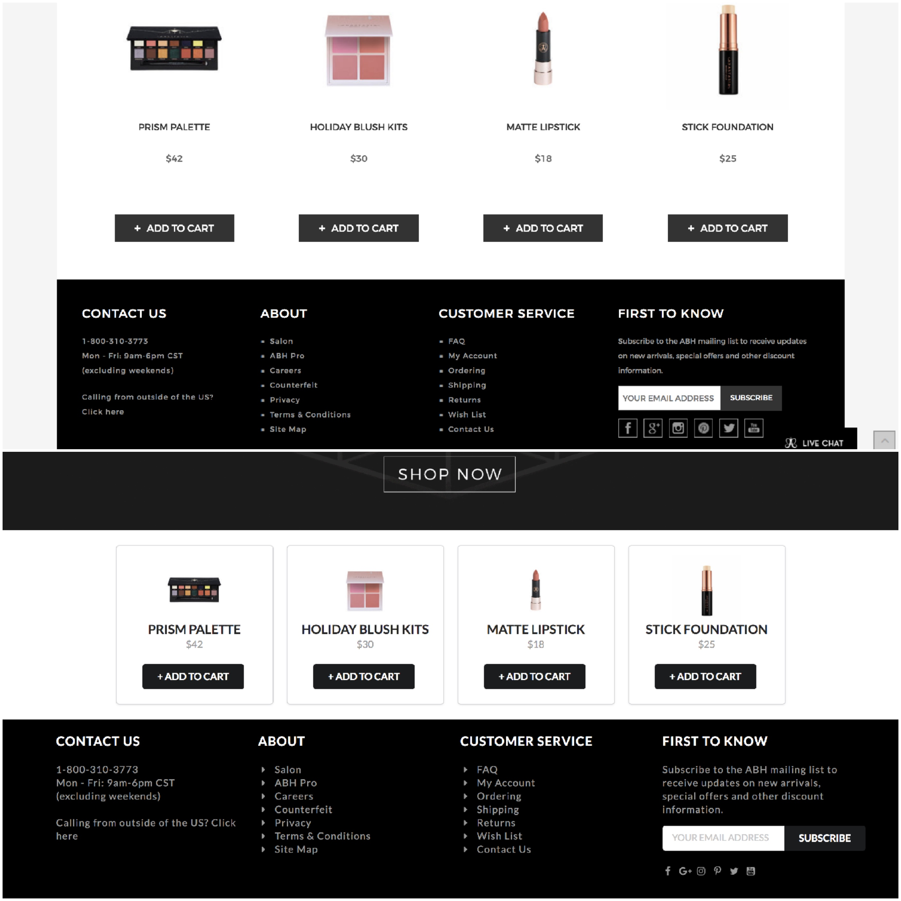

Semantic UI has been so fun to work with. For as long as I can remember, I've always wanted to design a website from scratch... and with Semantic UI I was finally able to fulfill that want. It'll only get better from here (or at least I hope it will 😉).

The deal with Semantic UI is that we change basic, plain, non-aesthetically pleasing pages likes this...

and turn them into this!

