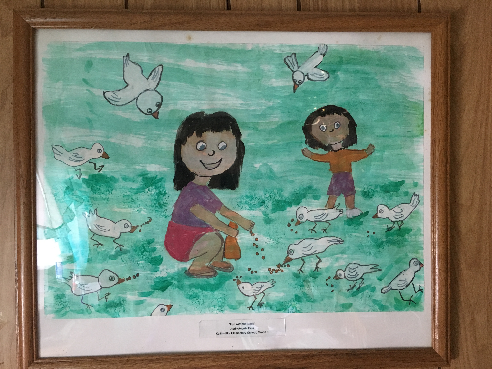
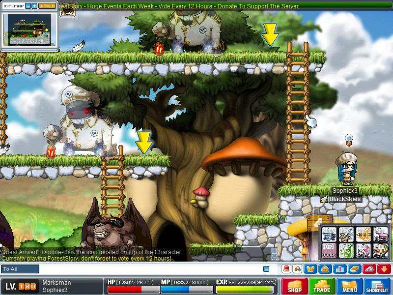

As a little girl, I loved anything that had to do with art. My parents supported this passion by providing me with crayons, markers, paint—anything I needed to fulfill my artistic needs. This is a painting I did in the 1st grade. Till this day, it’s still framed on a wall in our home. But, slowly and surely, my need for art began to phase out because I felt that my artistic abilities sucked compared to others. I did, however find a love for design from a graphics design class I took in high school and the making of my senior project website. 

Computer and video games also hold a huge part of my life and heart. One of the first computer games I played was a Lilo and Stitch game called *626 Sandwich Stacker*. I was hooked from the start, and that was only the beginning of my love for playing games. I juggled between computer games and videos games a lot. I liked playing on our Nintendo DS Lite, Wii, and PlayStation. But I also loved to play PC role-play games like MapleStory. Not only did I enjoy playing these games, but the graphics and structure interested me too. 

I’m glad I found something that will allow me to do it all—art, design, and technology. 
