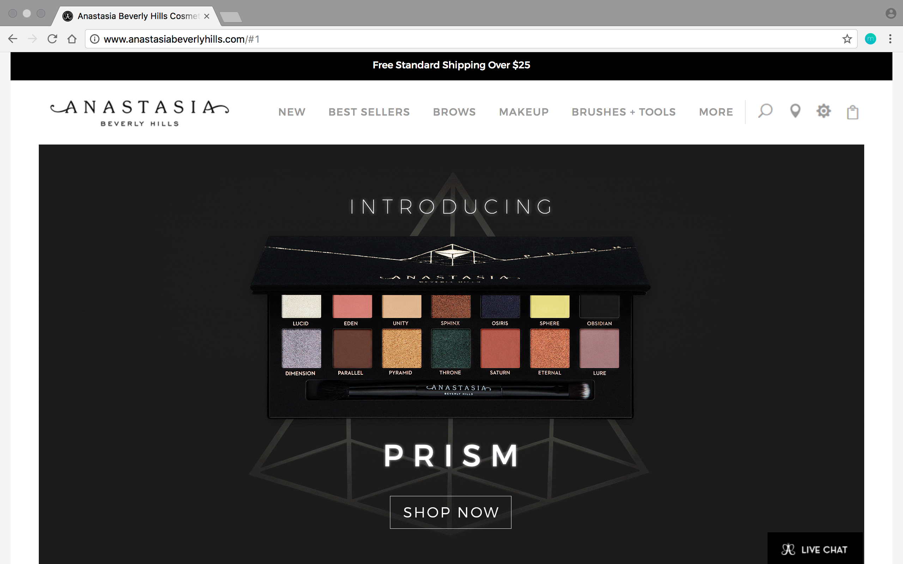
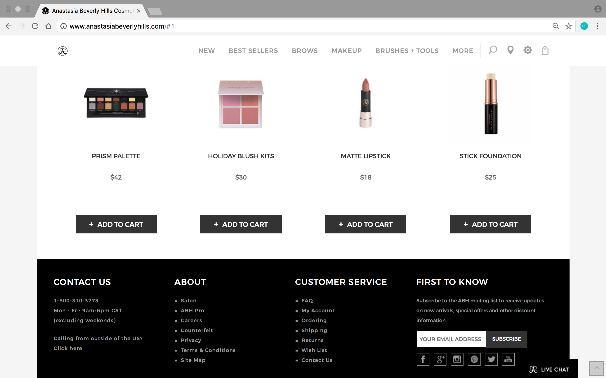
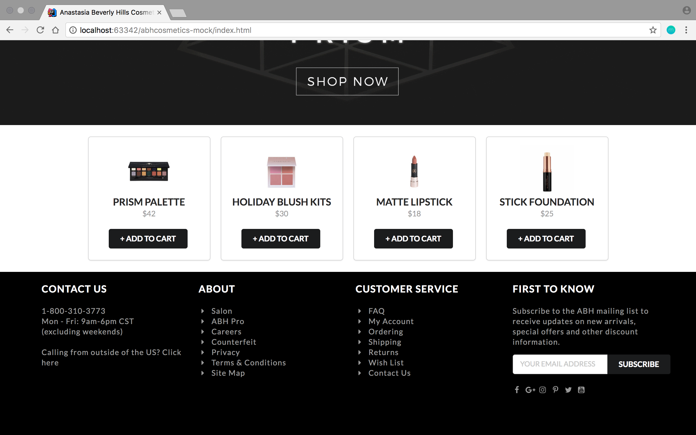

In my software engineering class we were introduced to the beauty of [Semantic UI](https://semantic-ui.com/). 

As a mini project, we were expected to take a non-Semantic UI website, and remake a page from it using Semantic UI elements. I chose to remake [Anastasia Beverly Hills](http://www.anastasiabeverlyhills.com/)' (ABH for short) home page. As part of my remake, I chose to implement the site's header and navigation bar, footer, and banner ad for their newly released product. Additionally, I used Semantic UI's [card](https://semantic-ui.com/views/card.html) element to display 

https://semantic-ui.com/views/card.html

At the time of this project, the ABH home page looked like this:

With Semantic UI, I was able to recreate it into this:

 
To see the code for this project, you can click [here](https://github.com/aprilbala/abhcosmetics-mock).
 

This project page is a WIP.

