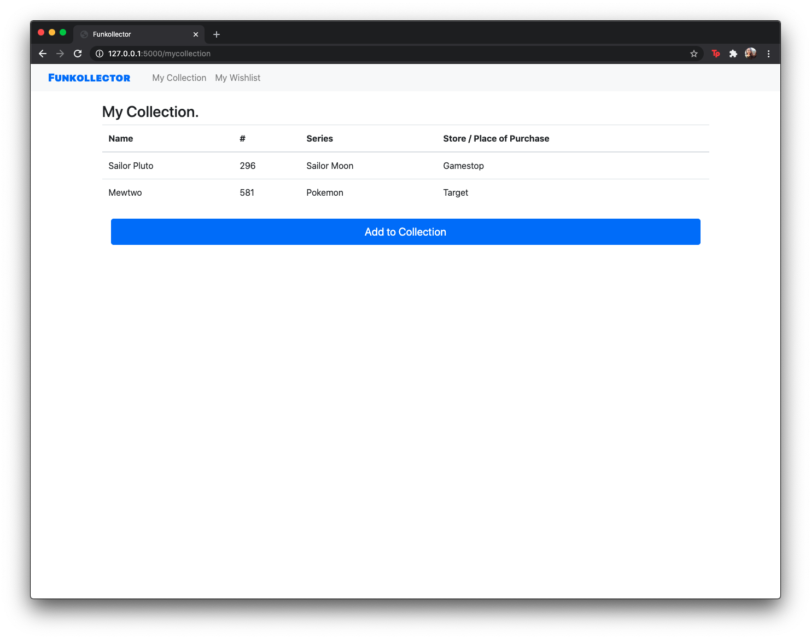
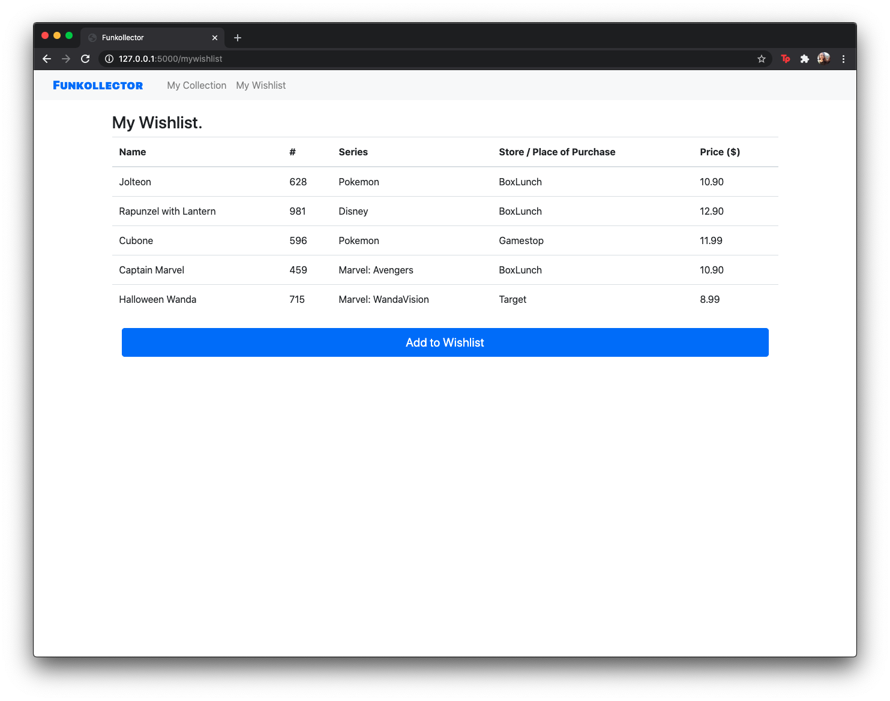
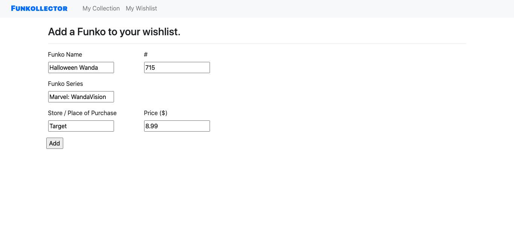

Funkollector is an assignment that was done for my ICS 321 class, Database Systems I. The purpose of this [assignment](https://lipyeow.github.io/ics321s18/morea/project/experience-project.html) was to create a database management system (DBMS) web application. 

I chose to use this assignment as a way to keep track of my collection of Funko Pops. Funko Pops are collectible vinyl figurines made by the [Funko](https://www.funko.com/) company. Over the years, I have accumulated over 20+ figurines. Till this day, my collection continues to grow, since the company releases new figurines every few months. 

At the time this project was done (Spring 2018), the Funko company did not have an app for collectors to use to track their figurine collection and wishlist. There were third-party made websites, but none were officially affiliated with the Funko company. It was not until 2019 that the Funko company made an [app](https://www.globenewswire.com/news-release/2019/03/13/1752658/0/en/Funko-Unveils-New-Mobile-Application-with-Fan-Favorite-Capabilities.html) that allowed consumers do so. 

For assignment purposes, Funkollector consisted of two lists: My Collection and My Wishlist. The <i>My Collection</i> list consisted of the Funko Pops a user owned, while <i>My Wishlist</i> consisted of figurines a user wanted to add to their collection.

  <figure>
    

    <i>My Collection</i> page
  </figure>

  <figure>
    

    <i>My Wishlist</i> page
  </figure>

Adding to the collection or wishlist lists could be done through their respective forms. Once a form is completed, the respective list is updated with the data the user inputted. 

  <figure>
    

    Form that will add to <i>My Collection</i>
  </figure>

  <figure>
    

    Form that will add to <i>My Wishlist</i>
  </figure>

Looking back on this project, there are definelty things I would improve and add. For instance, I would add a feature that allows a user to edit and remove existing entires on the <i>My Collection</i> and <i>My Wishlist</i> lists. Additionally, I would add a feature that allows users to move entries between the two lists (i.e. moving a Funko Pop added to <i>My Wishlist</i> to <i>My Collection</i>).

The code for this project can be found in my Funkollector repository on my GitHub [here](https://github.com/aprilbala/funkollector). Additionally, a video explaining the project can be found [here](https://www.youtube.com/watch?v=Tqvs8DM7cUA).

 

<!-- This project can be found [here](https://github.com/aprilbala/aprilbala.github.io/tree/master/projects/project-applet).
 -->
 <!-- Project instructions can are here: https://lipyeow.github.io/ics321s18/morea/project/experience-project.html -->