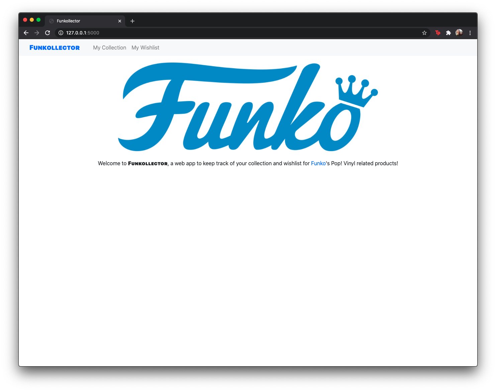
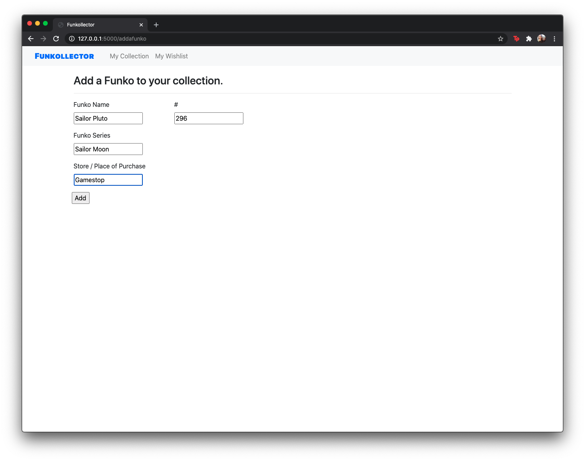

This is an assignment that was done for my ICS 321 class, Database Systems I. The purpose of this assignment was to create a database management system (DBMS) web application. 

At the time of this project, I had a growing collection of Funko Pops. Funko Pops are collectible vinyl figurines made by the [Funko](https://www.funko.com/) company. Every couple of months, the company releases 
 as more gets released, so did my collect As a Funko Pop collector, over the years I have accumulated over 20+ figurines. 

This is why I chose to use this project as a way to keep track of my current collection and wishlist.

The plan intended for this web app was to be able a track of two collections: 

The code for this project can be found in my Funkollector repository on my GitHub [here](https://github.com/aprilbala/funkollector). Additionally, a video explaining the project can be found [here](https://www.youtube.com/watch?v=Tqvs8DM7cUA).

This project page is a WIP.

<!-- This project can be found [here](https://github.com/aprilbala/aprilbala.github.io/tree/master/projects/project-applet).
 -->
 <!-- Project instructions can are here: https://lipyeow.github.io/ics321s18/morea/project/experience-project.html -->