In January 2018, Hawaii experienced a (thankfully) false alarm of an incoming ballistic missile, where alerts were issued statewide. A New York Times article regarding this event can be found [here](https://www.nytimes.com/2018/01/13/us/hawaii-missile.html). Due to this event, it inspired a group project for a software engineering class that I took. For this application, we were expected to create a "better" system that would decrease the chances of another mishap like this to happen again in the future. 

Not only did this project give us experience working as a team, it also allowed us to practice parts of the software development lifecycle (SDLC). Planning and mockups of our application were done, which in turn led to building our application based on the mockup that was chosen. 

The home page is simple, in which displays a user's choice of either a real alarm or drill. This causes the user to make the choice of a real or drill alarm in the very beginning. They would not be able to make the change from real to drill alarm, or vice versa, after this first choice,

Additionally, the color accents make it clear to distinguish whether the alarm they selected at the very start was real or a drill. We designed the application so that real and drill alarms have different accent colors--red was for real alarms and green for drills. 

On various pages, there are 'home' and 'back' page buttons, which allow the user to return to the home or previous page, respectively. 

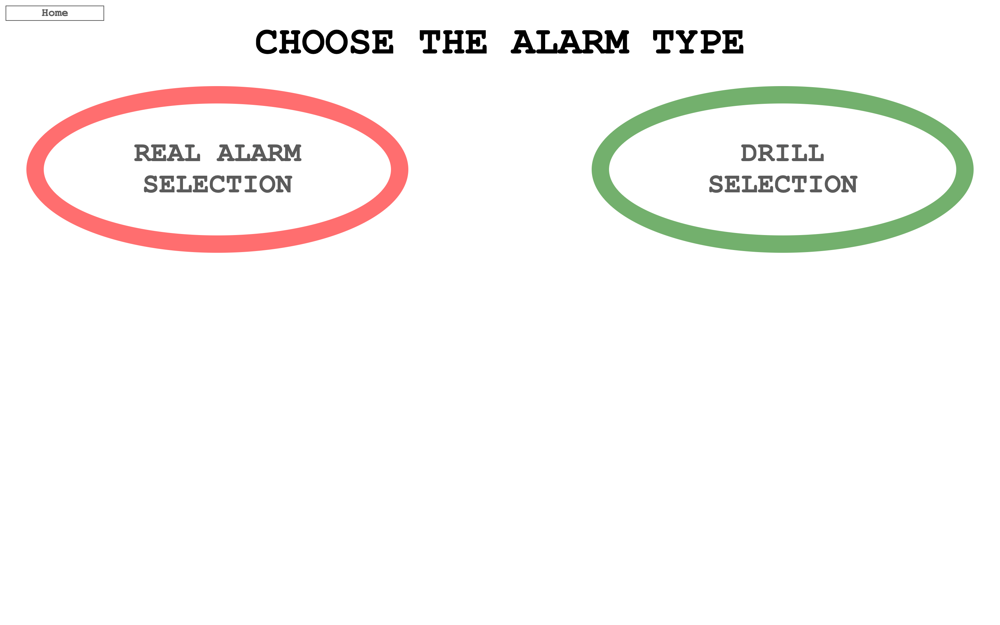

Below are screenshots of what it would look like if an individual were to send a real tsunami alarm via siren, text message, and radio alerts to Hawai'i Island.

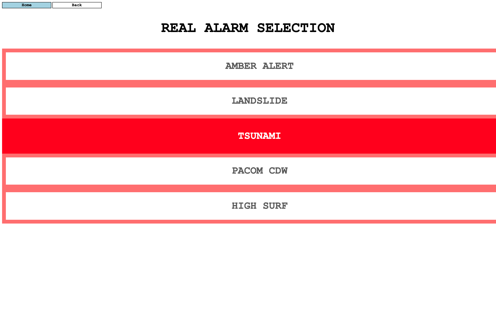
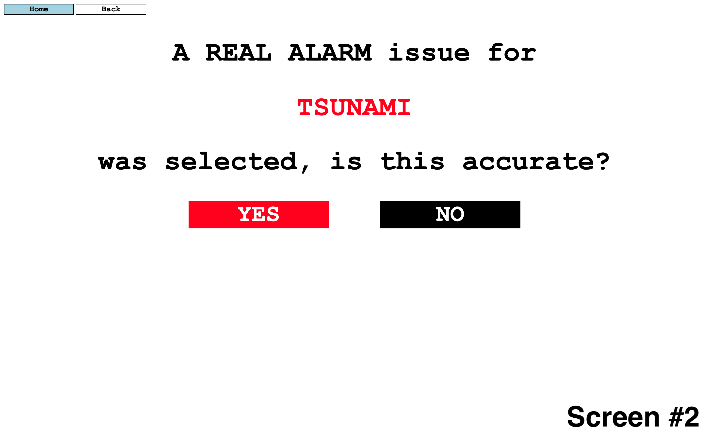
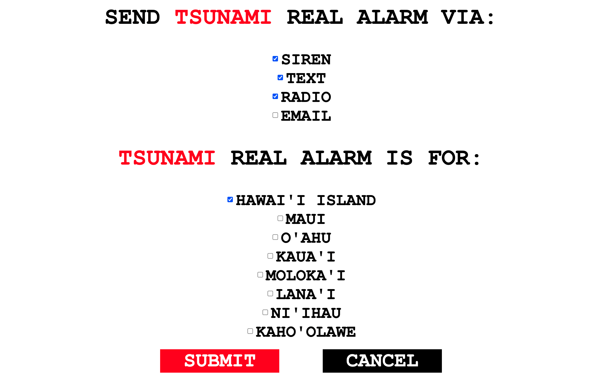
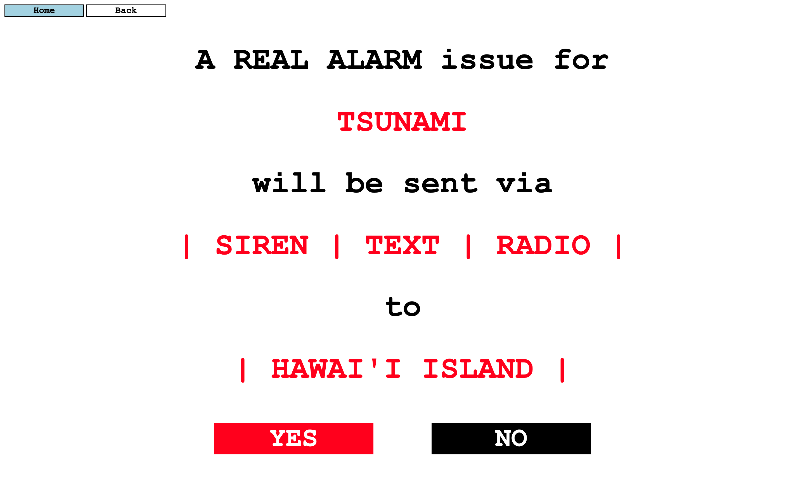
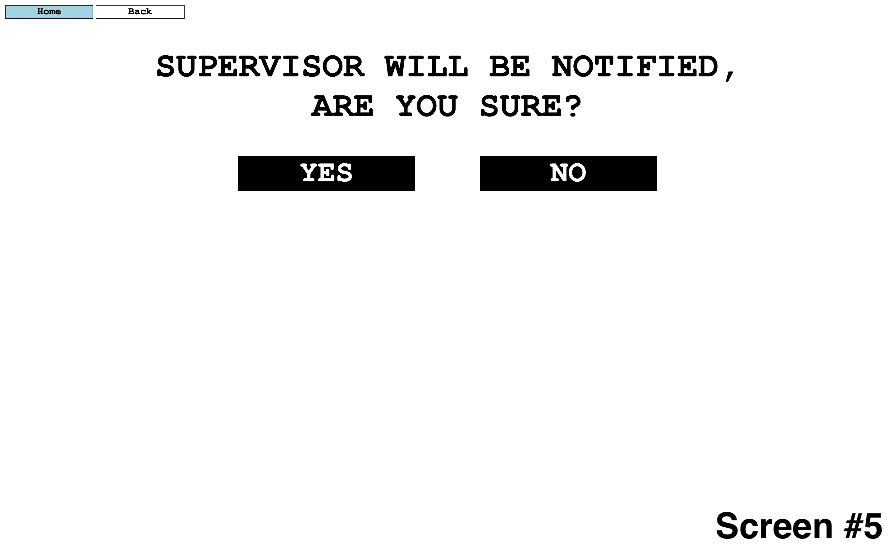
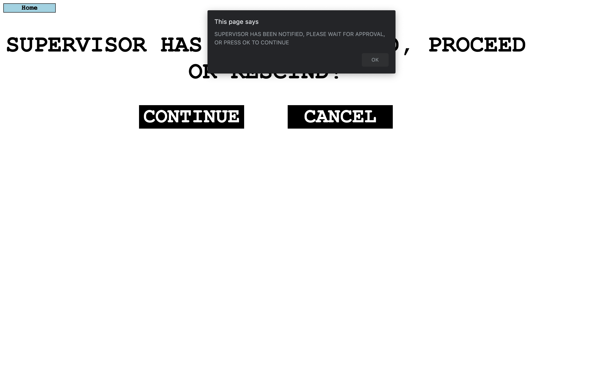
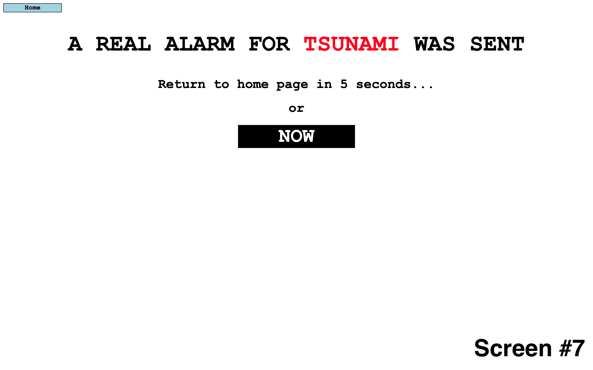

Next, are screenshots of what it would look like to send a drill alarm for a tsunami via siren and radio alerts to Hawai'i Island.

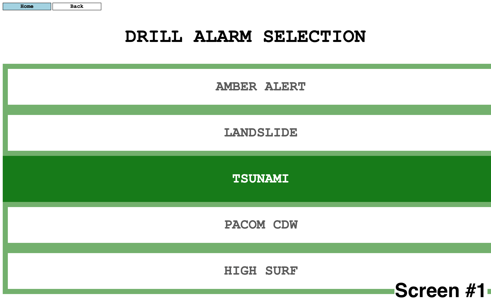
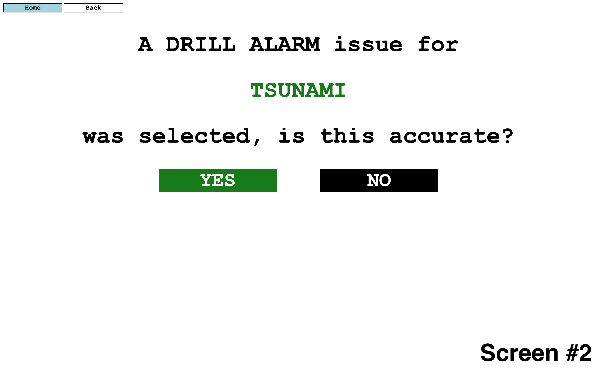
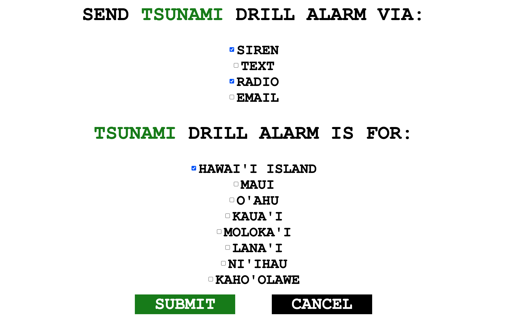
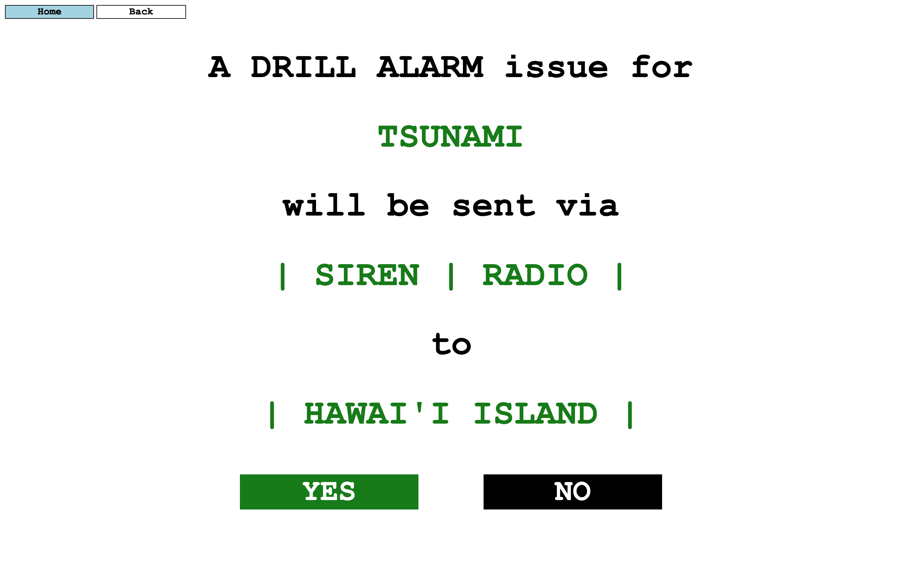
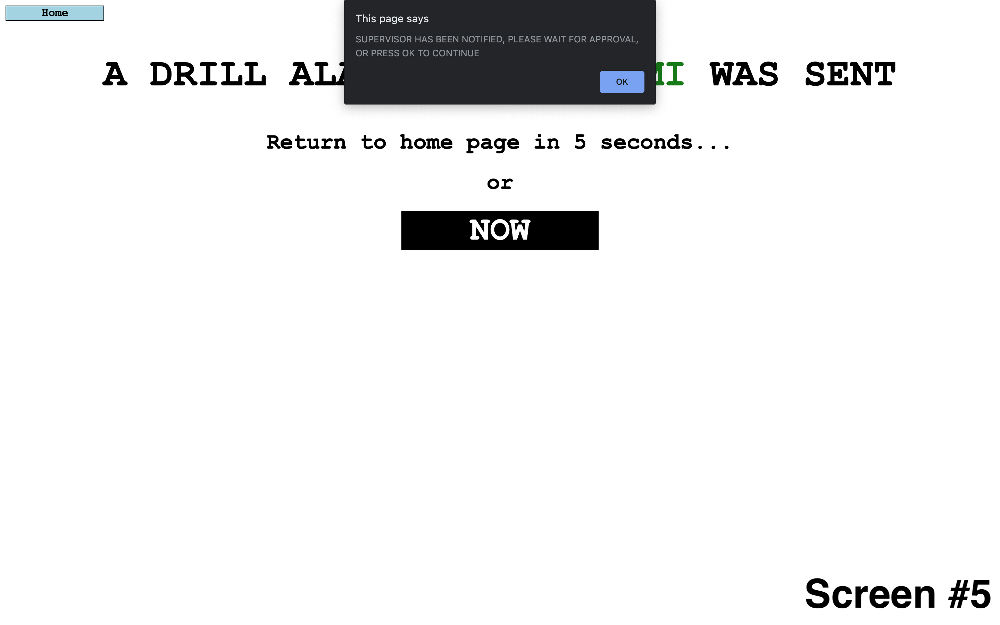

My contributions for this project was: fhakslfjhskfjh.

A video demonstration of this project can be found [here](https://www.youtube.com/watch?v=MYHrNHuo21U).

 

Note: This project page is a WIP.

<!-- Project icon [credit](https://unsplash.com/photos/LK8O-3VTrLY). -->