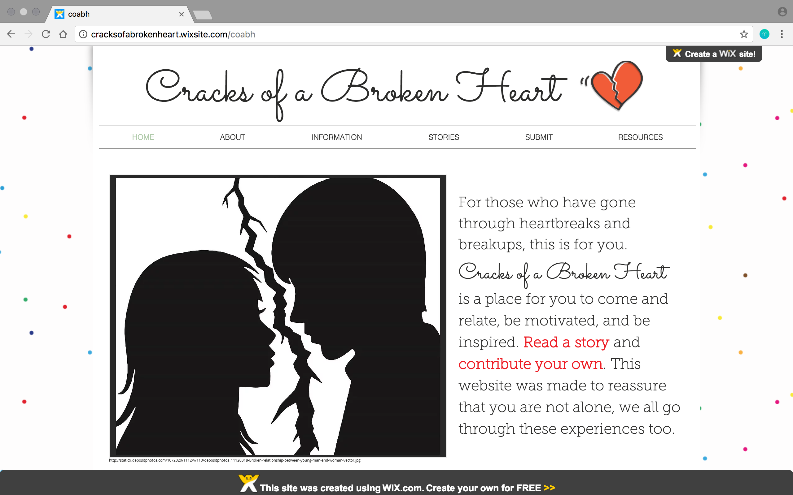
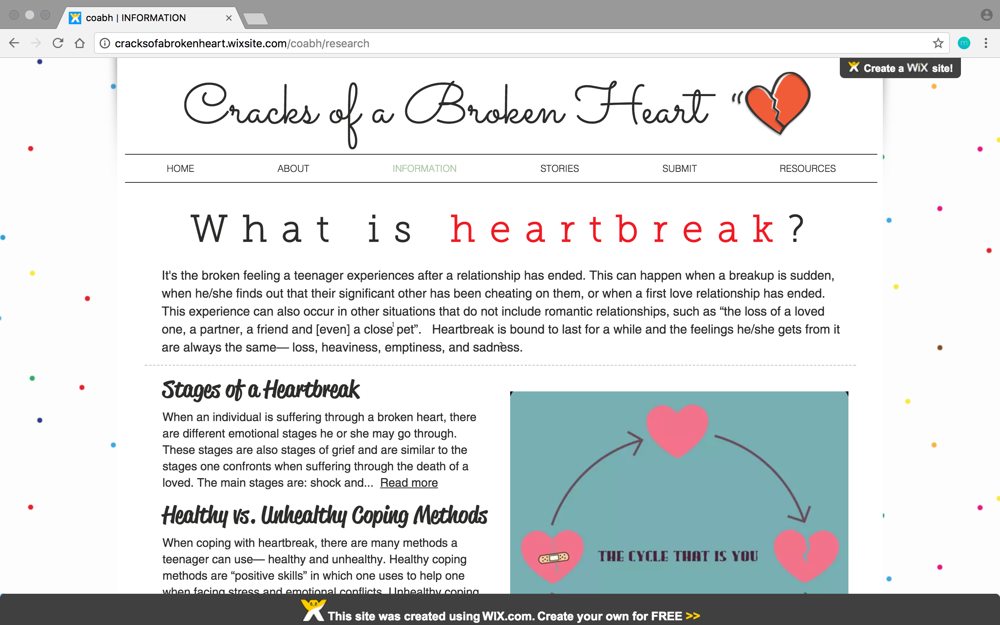
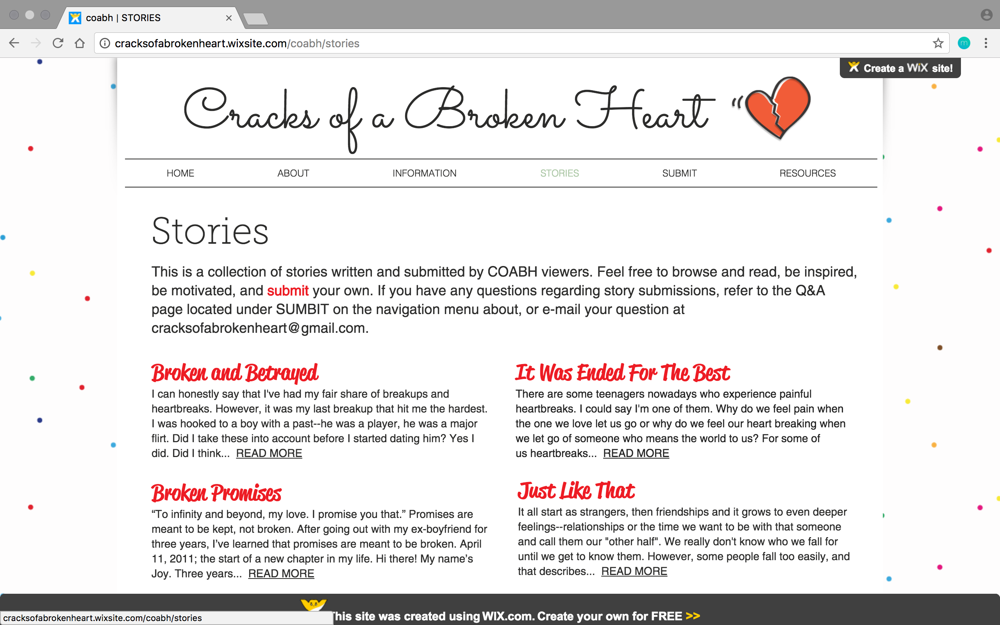
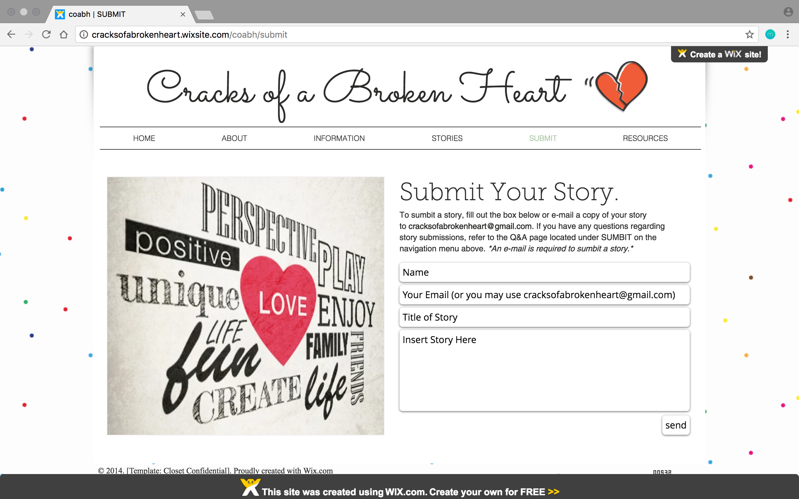

*Cracks of a Broken Heart* (COABH) is a website I created and managed for my high school senior project, *Coping Methods for Teenages and the End of Relationships*. This was a long-term project that started at the end of my junior year. It consisted of a research paper, product, and presentation. What I am sharing with you, is my product. 

COABH was a website I made that provided viewers information regarding heartbreaks and coping methods, which I gained knowledge of through my research paper. In addition, COABH was an interactive website that allowed users to read and submit their own heartbreak stories to share. I managed these submissions through a seperate email, 

The website was designed and made using [Wix](https://www.wix.com/), a free website builder that made it simple for me to make with the use of drag and drop tools.

Without the guidance and collaboration of my faculty and community advisors, I would not have been able to complete this project. I was able to experience 

This project sparked my interest in web design. I enjoyed putting this website together, and it was As I go further in my computer science degree, I hope to gain knowledge and practice to design websites from scratch, that way I can have full control of how the sites will be. 

To see more about this project, you can click [here](http://cracksofabrokenheart.wixsite.com/coabh).

~

Vacay is a web application that I helped create as a team project in ICS 415, Spring 2015. The project helped me learn how to design and implement a responsive web site.

Vacay is implemented using [Meteor](http://meteor.com), a JavaScript application platform. Within two weeks, we created a website that implements several types of reservations including flights, hotels, and car rentals.

In this project I gained experience with full-stack web application design and associated technologies, including [MongoDB](http://mongodb.com) for database storage, the [Twitter Bootstrap](http://getbootstrap.com/) CSS Framework for the user interface, and Javascript for both client and server-side programming. 
