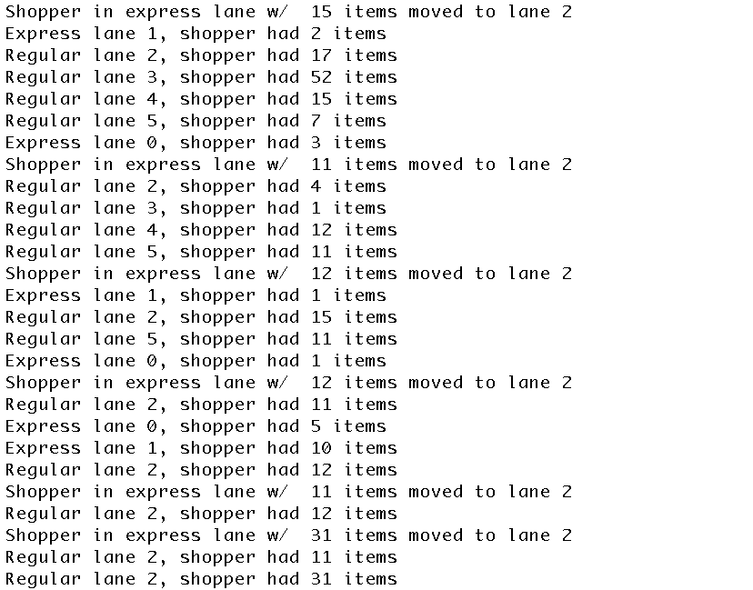

For this project, we were expected to use a circular array queue to simulate grocery store checkout lanes. T

There were two types of lanes: express and regular checkout lanes. In the regular checkout lanes, shoppers did not have a minimum or maximum number of items needed. On the other hand, the express lanes gave shoppers a limit of 10 items. If shoppers entered these lanes with more than 10 items, they will be moved to regular lane.

Here is a sample output with some test cases that I did:

The link to this project is [here](https://github.com/aprilbala/aprilbala.github.io/tree/master/projects/project-checkoutLanesQueue).
