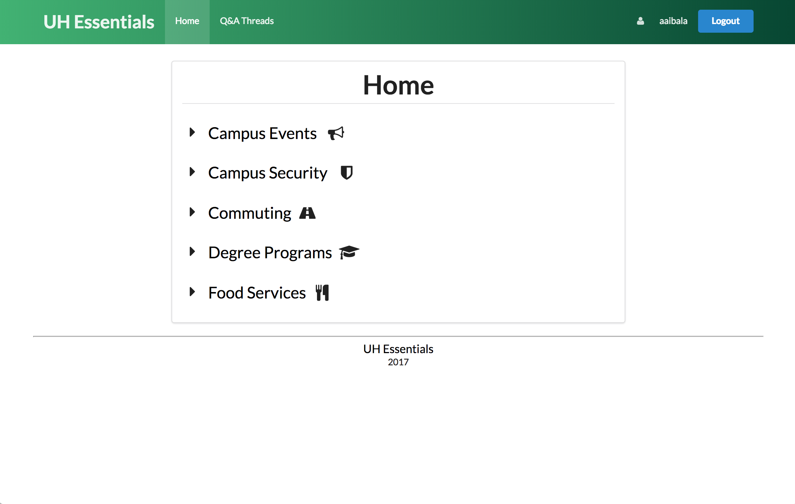

For a final project for my software engineering class, I was placed in a group to create a web application. For our application, we designed a forum-like system for the University of Hawaii (UH). It was geared to be a question-and-answer forum for students, professors, and other UH system attendees. The idea of our application comes from our love and addiction for Reddit. Ultimately, our future vision for this web application was to have it up and running for all ten campuses in the UH system. However, due to time constraints and for the sake of this project, we decided to only design the UH Essentials application for our home campus, UH Mānoa.

For this project, my contributions included creating HTML mockups. I mocked up the profile and submit page (which were forms) and the home page. Additionally, when we got into the functional aspects of our application, I implemented a campus collection (database) for the “campus” dropdown field in the profile form. I also attempted to implement a thread and topic collection that would hold all the incoming posts that would be submitted through the submit form. Unfortunately, we were not successful at getting this feature to work, so many of the posts seen on our application now are all default/sample posts. I was in charge of deploying our application to Galaxy. And finally, since I was in charge of deployment, I always made sure that everything was finalized and set to go before we turned our project in.

This project was quite an experience because interestingly enough, it was my first group coding project that I had to do. I liked that I was not alone in this project, and I’m glad that this experience was not a bad one.

To see more about this project, you can visit our project home page [here](https://uhessentials.github.io/).
